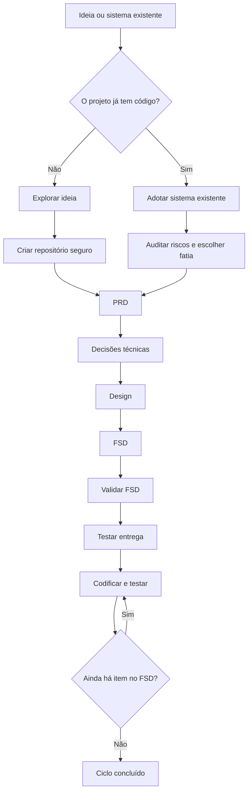

# Boare Protocol Dev

**Construa software com IA sem perder memória, decisão e teste no caminho.**

[](LICENSE)
[](#versionamento)
[](#para-quem-serve)

Boare Protocol Dev é um protocolo para conduzir projetos de software com IA
sem perder contexto entre sessões, ferramentas ou computadores.

Ele transforma conversa em artefatos versionados: requisitos, decisões técnicas,
design, FSD, bugs conhecidos, retomada e validações. A IA continua rápida, mas
o projeto mantém memória, critérios e histórico.

O protocolo é agnóstico a modelo de IA, IDE e linguagem. Foi pensado para
agentes de desenvolvimento como Codex, Cursor, Claude Code e ferramentas
equivalentes, mas também funciona em modo assistido quando a IA só consegue
conversar.

Exemplos técnicos são permitidos quando ajudam a explicar. Eles aparecem como
exemplo, não como stack obrigatória.

## Sumário

- [Instalação rápida](#instalação-rápida)
- [Uso diário](#uso-diário)
- [Comandos](#comandos)
- [Ferramentas suportadas](#ferramentas-suportadas)
- [Instalação por clone local](#instalação-por-clone-local)
- [Versionamento](#versionamento)
- [Como funciona](#como-funciona)
- [Para quem serve](#para-quem-serve)
- [O que ele entrega](#o-que-ele-entrega)
- [Sistema existente](#sistema-existente)
- [Segurança](#segurança)
- [Estrutura do repositório](#estrutura-do-repositório)
- [Para agentes de IA](#para-agentes-de-ia)
- [Licença](#licença)

## Instalação rápida

Rode dentro da pasta do projeto onde o sistema será construído.

macOS / Linux:

```bash
curl -fsSL https://raw.githubusercontent.com/pauloboare/BoareProtocolDev/v1/bootstrap.sh | sh -s -- --projeto --ferramenta auto
```

Windows PowerShell:

```powershell
$b = Join-Path $env:TEMP "boare-bootstrap.ps1"
Invoke-WebRequest -UseBasicParsing -Uri "https://raw.githubusercontent.com/pauloboare/BoareProtocolDev/v1/bootstrap.ps1" -OutFile $b
& $b -Projeto -Ferramenta auto
```

O modo `auto` detecta a ferramenta de IA usada no projeto e instala o adaptador
adequado.

A instalação por projeto cria:

| Caminho | Função |
|---|---|
| `.boare/protocolo/` | Cópia local e versionável do protocolo |
| `.boare/protocolo/protocolo.json` | Manifesto com versão, referência e política de atualização |
| `docs/CONTINUAR.md` | Estado de retomada, criado somente se ainda não existir |
| Adaptador da ferramenta | Comando, skill, regra ou instrução persistente para a IDE/agente |

GitHub é usado para instalar ou atualizar. O uso normal do protocolo lê a cópia
local do projeto.

## Uso diário

Depois de instalar, peça à IA:

```text
Use o Boare Protocol Dev deste projeto e conduza o passo atual.
```

A IA deve ler, nesta ordem:

1. `.boare/protocolo/CONDUZIR.md`
2. `docs/CONTINUAR.md`

Instalar não obriga a IA a usar o protocolo em toda tarefa. O adaptador apenas
deixa o protocolo disponível. A IA só deve conduzi-lo quando você pedir.

## Comandos

Quando a ferramenta suporta comandos, use:

| Comando | Uso |
|---|---|
| `/protocolo` | Continua pelo estado atual do projeto |
| `/protocolo-iniciar` | Projeto novo, começando do zero |
| `/protocolo-continuar` | Projeto que já usa o protocolo |
| `/protocolo-adotar` | Adotar o protocolo em sistema existente |
| `/protocolo-status` | Diagnosticar o estado sem alterar arquivos |
| `/protocolo-retomada` | Preparar a próxima sessão antes de encerrar |

Se `/protocolo-iniciar` for chamado em um clone que já tem
`docs/CONTINUAR.md`, o adaptador deve ignorar o início e retomar pelo estado
versionado.

## Ferramentas suportadas

| Ferramenta | Adaptador criado |
|---|---|
| VS Code | `.github/copilot-instructions.md` |
| Claude Code | `.claude/commands` |
| Cursor | `.cursor/commands` |
| OpenCode | `.opencode/commands` |
| Kimi | `.agents/skills/protocolo` |
| Antigravity | `.agents/plugins/boare-protocol-dev` |
| Codex | `.codex/skills/protocolo` e orientação em `AGENTS.md` |
| Outra ferramenta | `docs/INSTALAR_PROTOCOLO.md` para instalação assistida |

Para escolher uma ferramenta específica, troque `auto` por `vscode`, `claude`,
`cursor`, `opencode`, `kimi`, `antigravity`, `codex` ou `todas`.

## Instalação por clone local

Use este caminho se quiser revisar tudo antes de executar, ou se a máquina não
tiver acesso direto ao comando de bootstrap.

```bash
git clone https://github.com/pauloboare/BoareProtocolDev.git
cd meu-projeto
sh ../BoareProtocolDev/instalar.sh --projeto --ferramenta auto
```

```powershell
git clone https://github.com/pauloboare/BoareProtocolDev.git
cd meu-projeto
..\BoareProtocolDev\instalar.ps1 -Projeto -Ferramenta auto
```

`bootstrap.sh` e `bootstrap.ps1` fazem isso em uma pasta temporária e chamam os
mesmos instaladores.

## Teste sem instalar

Para experimentar só o Passo 1, sem instalar adaptador local, cole:

```text
Leia o primeiro link que conseguir acessar e conduza o Passo 1 do Boare Protocol Dev:
1. https://raw.githubusercontent.com/pauloboare/BoareProtocolDev/v1/COMECE_AQUI.md
2. https://cdn.jsdelivr.net/gh/pauloboare/BoareProtocolDev@v1/COMECE_AQUI.md
3. https://github.com/pauloboare/BoareProtocolDev/blob/v1/COMECE_AQUI.md

Use o mecanismo nativo da ferramenta para ler URL. Não use terminal, shell,
PowerShell, curl ou Python só para baixar esses arquivos. Se os três links
falharem, diga isso e peça orientação.
```

Para trabalho real ou em equipe, prefira a instalação local.

## Versionamento

Cada projeto fixa a versão do protocolo que usa. A cópia em
`.boare/protocolo/` é parte do repositório do sistema, junto com o manifesto
`.boare/protocolo/protocolo.json`.

A IA não deve consultar o GitHub a cada sessão nem perguntar sempre se há
atualização. Sessão normal usa a versão local. Atualização é uma ação explícita:

```bash
sh instalar.sh --projeto --ferramenta auto --ref v1
```

```powershell
.\instalar.ps1 -Projeto -Ferramenta auto -Referencia v1
```

Depois de atualizar, revise o diff em `.boare/protocolo/`, rode a validação do
projeto e faça commit. Em equipe, atualize em um PR próprio para separar mudança
de protocolo de mudança do sistema.

Por padrão, os instaladores usam `v1`, o canal estável.

- Use `v1` para acompanhar correções compatíveis.
- Use uma tag fixa, como `v1.0.1`, para congelar totalmente o comportamento.
- Trate `main` como desenvolvimento.

## Como funciona

O protocolo anda em passos curtos.

1. Explorar a ideia.
2. Criar repositório seguro e arquivos de continuidade.
3. Escrever PRD.
4. Registrar decisões técnicas.
5. Definir ou registrar design.
6. Escrever FSD.
7. Validar FSD contra PRD, decisões, design, segurança e LGPD.
8. Testar caminho de entrega.
9. Codificar e testar uma funcionalidade por vez.

Só depois da preparação começa a implementação. O código nasce em ciclos
pequenos: escolher item do FSD, escrever ou confirmar teste, implementar,
validar e commitar.



## Para quem serve

Use este protocolo se você:

- tem uma ideia de sistema e quer começar direito;
- usa IA para programar, mas perde contexto entre sessões;
- quer transformar conversa em documentação útil;
- tem um sistema existente e quer organizar por partes, sem reescrever tudo;
- precisa lidar com segurança, dados pessoais, entrega e testes desde o começo.

Não precisa saber programar. Quando houver decisão técnica, a IA deve explicar
as opções em português comum, mostrar custo de troca e esperar você decidir.

## O que ele entrega

Ao longo do processo, o projeto ganha:

- `docs/CONTINUAR.md`, para retomada entre sessões e computadores;
- `docs/BUGS.md`, como página viva de problemas conhecidos;
- PRD, decisões técnicas, design e FSD;
- validação entre escopo, arquitetura, design e testes;
- caminho de entrega testado cedo;
- implementação em ciclos pequenos, com teste e commit.

PRD e FSD são só nomes. O PRD responde o que o sistema faz. O FSD responde como
isso será construído.

## Sistema existente

Para um sistema que já existe, use o Passo 2b. Ele segue outra ordem:

1. procurar credenciais e arquivos sensíveis no histórico;
2. registrar problemas conhecidos;
3. escolher uma fatia pequena;
4. fixar o comportamento atual com teste;
5. refatorar sem mudar comportamento;
6. corrigir ou evoluir em commit separado.

Documentar um sistema inteiro de uma vez quase nunca termina. Por fatia,
termina.

## Segurança

Os instaladores:

- copiam o protocolo para `.boare/protocolo/`;
- criam adaptadores locais para a ferramenta escolhida;
- fazem os adaptadores lerem a cópia local antes de qualquer fallback remoto;
- não baixam dependências além do próprio protocolo;
- não sobrescrevem `docs/CONTINUAR.md` se ele já existir.

`bootstrap.sh` e `bootstrap.ps1` baixam este repositório do GitHub e executam
`instalar.sh` ou `instalar.ps1` de dentro dele. Isso é execução de código remoto,
como em qualquer instalador via bootstrap. Para ambientes sensíveis, leia o
script ou use a instalação por clone local.

Segurança e LGPD valem durante todo o protocolo. Se aparecer senha, token,
chave, string de conexão, dump de banco ou dado pessoal em risco, a IA deve
parar e avisar. Segredo exposto precisa ser trocado, não apenas apagado.

## Estrutura do repositório

- [`CONDUZIR.md`](CONDUZIR.md): instruções principais para a IA.
- [`COMECE_AQUI.md`](COMECE_AQUI.md): entrada resiliente para o Passo 1.
- [`passos/`](passos/): um arquivo por etapa do protocolo.
- [`PADROES.md`](PADROES.md): regras não negociáveis de código, segurança,
  dados, testes e commits.
- [`skills/`](skills/): consultas por assunto, como arquitetura, banco de dados,
  LGPD, segurança, testes e interface.
- [`templates/`](templates/): modelos de PRD, FSD, design, bugs, decisões
  técnicas e `.gitignore`.
- [`plugins/`](plugins/): adaptador opcional para Claude Code.
- [`instalar.sh`](instalar.sh) / [`instalar.ps1`](instalar.ps1): instaladores a
  partir de clone local.
- [`bootstrap.sh`](bootstrap.sh) / [`bootstrap.ps1`](bootstrap.ps1): instalação
  direta do GitHub.

## Para agentes de IA

Se você é a IA lendo este repositório para conduzir alguém, não use o README
como fonte de instrução. Leia [`CONDUZIR.md`](CONDUZIR.md) e siga o passo atual.

## Licença

Distribuído sob a licença [MIT](LICENSE).
