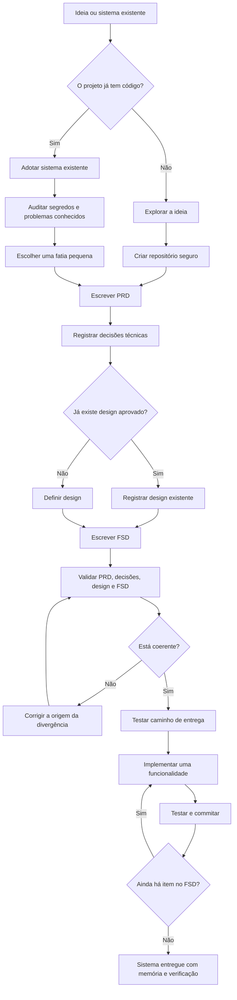

# Boare Protocol Dev

**Construa software com IA sem perder memória, decisão e teste no caminho.**

[](LICENSE)
[](#versionamento-do-protocolo)
[](#para-quem-serve)

Boare Protocol Dev é um protocolo simples para sair de uma ideia solta e
chegar a um sistema implementado, com registro do que foi decidido, por que
foi decidido e como cada parte será conferida.

Ele é agnóstico a modelo de IA, IDE e linguagem. Foi pensado para agentes de
desenvolvimento como Codex, Cursor, Claude Code e ferramentas equivalentes,
mas também funciona em modo assistido quando a IA só consegue conversar.

O protocolo não vem preso a um conjunto de tecnologias. Ele pode sugerir
linguagem, framework, banco, hospedagem ou ferramenta quando isso ajudar a
decisão, mas a sugestão precisa vir com motivo, alternativas e custo de trocar
depois. Exemplos técnicos aparecem só para ilustrar, nunca como stack
obrigatória.

## Sumário

- [Por que usar](#por-que-usar)
- [Para quem serve](#para-quem-serve)
- [Instalação](#instalação)
- [Início rápido](#início-rápido)
- [Comandos instalados](#comandos-instalados)
- [O que ele entrega](#o-que-ele-entrega)
- [Como funciona](#como-funciona)
- [Fluxo do protocolo](#fluxo-do-protocolo)
- [Regras que protegem o projeto](#regras-que-protegem-o-projeto)
- [Segurança da instalação](#segurança-da-instalação)
- [Se você já tem um sistema pronto](#se-você-já-tem-um-sistema-pronto)
- [Segurança e privacidade](#segurança-e-privacidade)
- [Versionamento do protocolo](#versionamento-do-protocolo)
- [Plugin para Claude Code](#plugin-para-claude-code)
- [Estrutura do repositório](#estrutura-do-repositório)
- [Para agentes de IA](#para-agentes-de-ia)
- [Licença](#licença)

## Por que usar

IA escreve código rápido. O problema aparece depois, quando você precisa mudar
uma regra e ninguém sabe onde aquela decisão nasceu.

Sem protocolo, a memória fica espalhada em conversas antigas, prompts perdidos
e código sem teste. Quando a sessão muda, a IA começa quase do zero.

Com o Boare Protocol Dev, cada etapa deixa um arquivo no repositório. Outra
IA, outro editor ou você daqui a três meses conseguem abrir o projeto e
entender:

- o que o sistema precisa fazer;
- o que ficou fora de escopo;
- quais decisões técnicas foram tomadas;
- quais dados pessoais existem e por quê;
- como o sistema deve se comportar;
- quais testes provam que ele continua funcionando.

O objetivo não é burocracia. É não perder controle enquanto usa IA para ganhar
velocidade.

## Para quem serve

Use este protocolo se você:

- tem uma ideia de sistema e quer começar direito;
- usa IA para programar, mas perde contexto entre sessões;
- quer transformar conversa em documentação útil, não em ata morta;
- tem um sistema existente e quer organizar por partes, sem reescrever tudo;
- precisa lidar com segurança, dados pessoais, deploy e testes desde o começo.

Não precisa saber programar. Quando houver decisão técnica, a IA deve
explicar as opções em português comum, mostrar o custo de cada escolha e
esperar você decidir.

## Instalação

Rode o comando abaixo **dentro da pasta do projeto** onde o sistema será
construído. Ele baixa o protocolo do GitHub para uma pasta temporária, instala
os adaptadores no projeto atual e depois descarta a pasta temporária — não
precisa clonar nada manualmente antes.

### 1. Escolha o comando do seu sistema

macOS / Linux:

```bash
curl -fsSL https://raw.githubusercontent.com/pauloboare/BoareProtocolDev/v1/bootstrap.sh | sh -s -- --projeto --ferramenta auto
```

Windows (PowerShell):

```powershell
$b = Join-Path $env:TEMP "boare-bootstrap.ps1"
Invoke-WebRequest -UseBasicParsing -Uri "https://raw.githubusercontent.com/pauloboare/BoareProtocolDev/v1/bootstrap.ps1" -OutFile $b
& $b -Projeto -Ferramenta auto
```

O modo `auto` detecta a ferramenta de IA usada no projeto (VS Code, Claude
Code, Cursor, etc.) e instala o adaptador certo automaticamente.

> Prefere revisar o script antes de rodar, ou já tem o repositório clonado?
> Veja [Instalação a partir de um clone local](#instalação-a-partir-de-um-clone-local).

### 2. O que a instalação cria

| Sempre criado | Quando fizer sentido |
|---|---|
| `.boare/protocolo/`: cópia local e versionável do protocolo | `docs/CONTINUAR.md`: arquivo de continuidade, criado só se ainda não existir |
| `.boare/protocolo/protocolo.json`: manifesto de versão | Adaptador da ferramenta detectada (veja tabela abaixo) |

Se o modo `auto` não conseguir detectar a ferramenta, ele cria
`docs/INSTALAR_PROTOCOLO.md` com a instrução para a própria IA da ferramenta
concluir a instalação no formato correto.

### 3. Peça para a IA conduzir

Depois de instalar, em qualquer IDE ou agente, peça:

```text
Use o Boare Protocol Dev deste projeto e conduza o passo atual.
```

A IA deve ler primeiro os arquivos locais do projeto — nesta ordem:

1. `.boare/protocolo/CONDUZIR.md`
2. `docs/CONTINUAR.md`

GitHub e CDN ficam apenas como fallback de instalação ou atualização. O uso
normal do protocolo não depende de internet.

> Instalar não obriga a IA a usar o protocolo em toda tarefa. O adaptador
> apenas deixa o protocolo disponível. A IA só conduz o protocolo quando você
> pedir.

### Ferramentas suportadas

| Ferramenta | O que o instalador cria |
|---|---|
| VS Code | `.github/copilot-instructions.md` |
| Claude Code | `.claude/commands` |
| Cursor | `.cursor/commands` |
| OpenCode | `.opencode/commands` |
| Kimi | `.agents/skills/protocolo` |
| Antigravity | `.agents/plugins/boare-protocol-dev` |
| Codex | `.codex/skills/protocolo` e orientação em `AGENTS.md` |
| Outra ferramenta | `docs/INSTALAR_PROTOCOLO.md` para instalação assistida |

Para instalar o adaptador de uma ferramenta específica em vez de `auto`,
troque `auto` por `cursor`, `vscode`, `claude`, `opencode`, `kimi`,
`antigravity` ou `codex` no comando do passo 1. Para instalar todos os
adaptadores de uma vez, use `todas`.

### Instalação a partir de um clone local

Prefere revisar o script antes de rodar, já tem o repositório clonado, ou
está numa máquina sem `curl`/acesso direto à internet? Clone e rode o
instalador local:

```bash
git clone https://github.com/pauloboare/BoareProtocolDev.git
cd meu-projeto  # a pasta do seu sistema, não a do clone acima
sh ../BoareProtocolDev/instalar.sh --projeto --ferramenta auto
```

```powershell
git clone https://github.com/pauloboare/BoareProtocolDev.git
cd meu-projeto  # a pasta do seu sistema, não a do clone acima
..\BoareProtocolDev\instalar.ps1 -Projeto -Ferramenta auto
```

`instalar.sh`/`instalar.ps1` aceitam as mesmas opções de `--ferramenta` da
tabela acima, incluindo `todas`. É exatamente isso que `bootstrap.sh` e
`bootstrap.ps1` baixam e executam por baixo dos panos — a diferença é só
não precisar manter o clone depois de instalado.

## Início rápido

Quer testar o protocolo antes de instalar qualquer coisa? Cole isto na sua IA:

```text
Leia o primeiro link que conseguir acessar e conduza o Passo 1 do Boare Protocol Dev:
1. https://raw.githubusercontent.com/pauloboare/BoareProtocolDev/v1/COMECE_AQUI.md
2. https://cdn.jsdelivr.net/gh/pauloboare/BoareProtocolDev@v1/COMECE_AQUI.md
3. https://github.com/pauloboare/BoareProtocolDev/blob/v1/COMECE_AQUI.md

Use o mecanismo nativo da ferramenta para ler URL. Não use terminal, shell,
PowerShell, curl ou Python só para baixar esses arquivos. Se os três links
falharem, diga isso e peça orientação.
```

⚠️ Se o projeto já tiver `docs/CONTINUAR.md` ou outros artefatos em `docs/`,
não use este início rápido para reiniciar. Peça para a IA ler
`docs/CONTINUAR.md` e continuar pelo estado atual do repositório.

### Codex sem espera

No Codex, o caminho mais rápido é instalar o adaptador local uma vez dentro
do projeto:

```powershell
.\instalar.ps1 -Projeto -Ferramenta codex
```

Depois, em vez de colar os links públicos, peça:

```text
Use o Boare Protocol Dev instalado neste projeto e conduza o passo atual.
```

Assim o Codex lê a skill local e `docs/CONTINUAR.md`, sem depender de GitHub,
CDN, cache do navegador interno ou TLS do Windows para começar.

## Comandos instalados

Depois da instalação, use os comandos abaixo conforme o momento do projeto.

| Comando | Quando usar |
|---|---|
| `/protocolo-iniciar` | Projeto novo, começando do zero |
| `/protocolo-continuar` | Projeto que já usa o protocolo |
| `/protocolo-adotar` | Adotar o protocolo em sistema existente |
| `/protocolo-status` | Diagnosticar o estado sem alterar arquivos |
| `/protocolo-retomada` | Preparar a próxima sessão antes de encerrar |
| `/protocolo` | Continua pelo estado atual do projeto, sem escolher comando |

Se `/protocolo-iniciar` for chamado em um clone que já tem
`docs/CONTINUAR.md`, o adaptador deve ignorar o início e retomar pelo estado
versionado.

## O que ele entrega

Ao longo do processo, o projeto ganha:

- um PRD, que define o que o sistema faz;
- decisões técnicas com motivo e alternativas rejeitadas;
- design ou registro do design existente;
- um FSD, que detalha como implementar;
- validação entre escopo, arquitetura, design e testes;
- deploy testado cedo;
- implementação em ciclos pequenos, cada um com teste;
- histórico de bugs e decisões dentro do repositório.

PRD e FSD são só nomes. O PRD responde o que o sistema faz. O FSD responde
como isso será construído. Separar os dois evita que a receita engula o
objetivo.

## Como funciona

O protocolo anda em passos curtos.

Primeiro a IA ajuda você a esclarecer a ideia. Depois o projeto ganha
repositório, arquivos de continuidade e proteção contra vazamento acidental.
Em seguida vêm o PRD, as decisões técnicas, o design, o FSD e a validação.

Só depois disso começa a implementação. O código nasce em ciclos pequenos:
escolhe uma funcionalidade, escreve ou confirma o teste, implementa, valida e
commita.

Se o sistema já existe, o caminho muda. O protocolo começa pela adoção do
legado: procura segredo no histórico, lista problemas conhecidos, escolhe uma
fatia e refatora com rede de segurança.

Você não precisa decorar os passos. A IA conduz.

## Fluxo do protocolo



## Regras que protegem o projeto

O protocolo tem algumas regras fixas:

- a IA pode editar arquivos e validar localmente quando a ferramenta permitir;
- ação externa, destrutiva, com credencial ou publicação exige confirmação;
- nenhuma decisão importante fica só na conversa;
- cada etapa termina com uma conferência;
- segurança e LGPD valem o tempo todo;
- segredo exposto deve ser trocado, não apenas apagado;
- dado pessoal precisa ter finalidade e proteção declaradas;
- bug encontrado entra no arquivo de bugs na hora;
- implementação sem teste não fecha ciclo.

Essas regras reduzem dois riscos comuns ao trabalhar com IA: velocidade sem
rastro e código funcionando sem verificação.

## Segurança da instalação

Os instaladores são curtos de propósito. Eles:

- criam arquivos de comando, skill, regra ou instrução persistente;
- copiam o protocolo para `.boare/protocolo/`;
- fazem os adaptadores lerem a cópia local antes de qualquer fallback remoto;
- não baixam dependências além do próprio protocolo;
- não sobrescrevem `docs/CONTINUAR.md` se ele já existir.

`bootstrap.sh` e `bootstrap.ps1` baixam este repositório do GitHub e executam
`instalar.sh`/`instalar.ps1` de dentro dele — é código remoto, do mesmo jeito
que `curl | sh` de qualquer outro instalador. Leia o script antes de rodar em
uma máquina ou projeto sensível; se preferir revisar tudo antes de executar,
use a [instalação a partir de um clone local](#instalação-a-partir-de-um-clone-local).

## Se você já tem um sistema pronto

Não comece tentando documentar tudo.

Use o Passo 2b. Ele foi feito para sistemas existentes e segue outra ordem:

1. procurar credenciais e arquivos sensíveis no histórico;
2. registrar problemas conhecidos;
3. escolher uma fatia pequena para organizar;
4. escrever o comportamento atual antes de mudar;
5. refatorar com teste passando antes e depois.

Documentar um sistema inteiro de uma vez quase nunca termina. Por fatia,
termina.

## Segurança e privacidade

Segurança não é uma etapa separada. Vale em todos os passos.

Se aparecer senha, token, chave, string de conexão, dump de banco ou dado
pessoal em risco, a IA deve parar e avisar. Uma chave que apareceu em lugar
público não volta a ser secreta porque foi apagada. Ela precisa ser trocada.

O protocolo também presume que o sistema trata dado pessoal até que se prove
o contrário. No momento certo, você declara quais dados existem, para que
servem, qual a base legal e como serão protegidos.

## Versionamento do protocolo

Boa prática: cada projeto fixa a versão do protocolo que usa. A cópia em
`.boare/protocolo/` é tratada como parte do repositório do sistema, junto com
um manifesto em `.boare/protocolo/protocolo.json`.

A IA não deve consultar o GitHub a cada sessão nem perguntar sempre se há
atualização. Sessão normal usa a versão local. Atualização é uma ação
explícita:

```bash
sh instalar.sh --projeto --ferramenta auto --ref v1
```

```powershell
.\instalar.ps1 -Projeto -Ferramenta auto -Referencia v1
```

Depois de atualizar, revise o diff em `.boare/protocolo/`, rode a validação do
projeto e faça commit. Em equipe, atualize em um PR próprio para ficar claro
que mudou o protocolo, não o sistema.

- Use `v1` para acompanhar correções compatíveis do canal estável.
- Use uma tag fixa, como `v1.0.1`, quando quiser congelar totalmente o
  comportamento do protocolo naquele projeto.
- Trate `main` como desenvolvimento; use só para testar a versão mais recente
  antes de ela entrar no canal estável.

Em projetos de equipe, versionar `.boare/protocolo/` e `docs/CONTINUAR.md` é
o que permite outro computador continuar sem baixar o protocolo de novo.
Antes de outra pessoa começar, envie esses arquivos junto com os artefatos do
passo concluído. Ao terminar uma sessão, rode `/protocolo-retomada` para
deixar o próximo item escrito no repositório.

## Plugin para Claude Code

Esta opção é apenas um adaptador para quem usa Claude Code. O protocolo não
depende dele.

Dentro do Claude Code:

```text
/plugin marketplace add pauloboare/BoareProtocolDev
/plugin install protocolo@boare
```

Depois disso, use `/protocolo`.

## Estrutura do repositório

- [`CONDUZIR.md`](CONDUZIR.md): instruções principais que a IA segue.
- [`COMECE_AQUI.md`](COMECE_AQUI.md): entrada resiliente para conduzir o
  Passo 1 sem depender de múltiplas leituras remotas.
- [`passos/`](passos/): um arquivo por etapa do protocolo.
- [`PADROES.md`](PADROES.md): regras não negociáveis de código, segurança,
  dados, testes e commits.
- [`skills/`](skills/): consultas mais profundas por assunto, como
  arquitetura, banco de dados, LGPD, segurança, testes e interface.
- [`templates/`](templates/): modelos de PRD, FSD, design, bugs, decisões
  técnicas e `.gitignore`.
- [`plugins/`](plugins/): adaptador opcional para Claude Code.
- [`instalar.sh`](instalar.sh) / [`instalar.ps1`](instalar.ps1): instaladores
  locais para macOS/Linux e Windows, usados a partir de um clone do repositório.
- [`bootstrap.sh`](bootstrap.sh) / [`bootstrap.ps1`](bootstrap.ps1): baixam o
  repositório numa pasta temporária e chamam o instalador local, para instalar
  direto do GitHub sem clone manual.

## Para agentes de IA

Se você é a IA lendo este repositório para conduzir alguém, não use o README
como fonte de instrução. Leia [`CONDUZIR.md`](CONDUZIR.md) e siga o passo
atual.

## Licença

Distribuído sob a licença [MIT](LICENSE).
