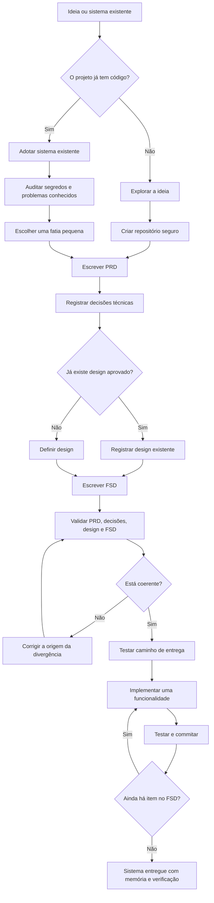

# Boare Protocol Dev

Construa software com IA sem perder memória, decisão e teste no caminho.

Boare Protocol Dev é um protocolo simples para sair de uma ideia solta e chegar
a um sistema implementado com registro do que foi decidido, por que foi decidido
e como cada parte será conferida.

Ele é agnóstico a modelo de IA, IDE e linguagem. Foi pensado para agentes de
desenvolvimento como Codex, Cursor, Claude Code e ferramentas equivalentes, mas
também funciona em modo assistido quando a IA só consegue conversar.

O protocolo não vem preso a um conjunto de tecnologias. Ele pode sugerir
linguagem, framework, banco, hospedagem ou ferramenta quando isso ajudar a
decisão, mas a sugestão precisa vir com motivo, alternativas e custo de trocar
depois.

Exemplos técnicos são permitidos quando ajudam a explicar. Eles devem aparecer
como exemplo, não como stack obrigatória.

## Quick Start

Abra a IA que você usa e cole:

```text
Leia o primeiro link que conseguir acessar e conduza o Passo 1 do Boare Protocol Dev:
1. https://raw.githubusercontent.com/pauloboare/BoareProtocolDev/v1/COMECE_AQUI.md
2. https://cdn.jsdelivr.net/gh/pauloboare/BoareProtocolDev@v1/COMECE_AQUI.md
3. https://github.com/pauloboare/BoareProtocolDev/blob/v1/COMECE_AQUI.md

Use o mecanismo nativo da ferramenta para ler URL. Não use terminal, shell,
PowerShell, curl ou Python só para baixar esses arquivos. Se os três links
falharem, diga isso e peça orientação.
```

Pronto. A IA vai fazer uma pergunta por vez e conduzir o restante.

Esse modo funciona em Codex, Cursor, Claude Code, ChatGPT, Claude, Gemini e
qualquer ferramenta capaz de ler uma URL pública.

Se o projeto já tiver `docs/CONTINUAR.md` ou outros artefatos em `docs/`, não
use o Quick Start para reiniciar. Peça para a IA ler `docs/CONTINUAR.md` e
continuar pelo estado atual do repositório.

### Codex sem espera

No Codex, o caminho mais rápido é instalar o adaptador local uma vez dentro do
projeto:

```powershell
.\instalar.ps1 -Projeto -Ferramenta codex
```

Depois, em vez de colar os links públicos, peça:

```text
Use o Boare Protocol Dev instalado neste projeto e conduza o passo atual.
```

Assim o Codex lê a skill local e `docs/CONTINUAR.md`, sem depender de GitHub,
CDN, cache do navegador interno ou TLS do Windows para começar.

## Instalação

Você não precisa instalar nada para usar o protocolo. A instalação só cria
adaptadores locais quando a ferramenta suporta comandos, skills, regras ou
instruções persistentes.

Uso recomendado dentro de um projeto:

```bash
sh instalar.sh --projeto --ferramenta auto
```

```powershell
.\instalar.ps1 -Projeto -Ferramenta auto
```

O modo `auto` procura sinais da ferramenta no projeto. Se não conseguir
detectar, cria `docs/INSTALAR_PROTOCOLO.md` com a instrução para a própria IA da
ferramenta instalar no formato correto.

Para instalar todos os adaptadores de projeto:

```bash
sh instalar.sh --projeto --ferramenta todas
```

```powershell
.\instalar.ps1 -Projeto -Ferramenta todas
```

### Ferramentas suportadas

| Ferramenta | O que o instalador cria |
|---|---|
| VS Code | `.github/copilot-instructions.md` |
| Claude Code | `.claude/commands` |
| Cursor | `.cursor/commands` |
| OpenCode | `.opencode/commands` |
| Kimi | `.agents/skills/protocolo` |
| Antigravity | `.agents/plugins/boare-protocol-dev` |
| Codex | `.codex/skills/protocolo` e orientação em `AGENTS.md` |
| Outra ferramenta | `docs/INSTALAR_PROTOCOLO.md` para instalação assistida |

Quando a ferramenta suporta comandos, use `/protocolo`. Quando ela trabalha por
skills, regras ou instruções persistentes, peça para usar o Boare Protocol Dev e
a própria ferramenta deve carregar o adaptador instalado.

Instalar não obriga a IA a usar o protocolo em toda tarefa. O adaptador apenas
deixa o protocolo disponível. A IA só deve conduzi-lo quando você pedir.

### Instalação por ferramenta

```bash
sh instalar.sh --projeto --ferramenta cursor
sh instalar.sh --projeto --ferramenta vscode
sh instalar.sh --projeto --ferramenta claude
sh instalar.sh --projeto --ferramenta opencode
sh instalar.sh --projeto --ferramenta kimi
sh instalar.sh --projeto --ferramenta antigravity
sh instalar.sh --projeto --ferramenta codex
```

```powershell
.\instalar.ps1 -Projeto -Ferramenta cursor
.\instalar.ps1 -Projeto -Ferramenta vscode
.\instalar.ps1 -Projeto -Ferramenta claude
.\instalar.ps1 -Projeto -Ferramenta opencode
.\instalar.ps1 -Projeto -Ferramenta kimi
.\instalar.ps1 -Projeto -Ferramenta antigravity
.\instalar.ps1 -Projeto -Ferramenta codex
```

## Comandos instalados

Depois da instalação, use:

Projeto novo:

```text
/protocolo-iniciar
```

Se esse comando for chamado em um clone que já tem `docs/CONTINUAR.md`, o
adaptador deve ignorar o início e retomar pelo estado versionado.

Continuar projeto que já usa o protocolo:

```text
/protocolo-continuar
```

Adotar o protocolo em sistema existente:

```text
/protocolo-adotar
```

Diagnosticar o estado sem alterar arquivos:

```text
/protocolo-status
```

Preparar a próxima sessão:

```text
/protocolo-retomada
```

O comando `/protocolo` continua pelo estado atual do projeto.

## Por que usar

IA escreve código rápido. O problema aparece depois, quando você precisa mudar
uma regra e ninguém sabe onde aquela decisão nasceu.

Sem protocolo, a memória fica espalhada em conversas antigas, prompts perdidos e
código sem teste. Quando a sessão muda, a IA começa quase do zero.

Com o Boare Protocol Dev, cada etapa deixa um arquivo no repositório. Outra IA,
outro editor ou você daqui a três meses conseguem abrir o projeto e entender:

- o que o sistema precisa fazer;
- o que ficou fora de escopo;
- quais decisões técnicas foram tomadas;
- quais dados pessoais existem e por quê;
- como o sistema deve se comportar;
- quais testes provam que ele continua funcionando.

O objetivo não é burocracia. É não perder controle enquanto usa IA para ganhar
velocidade.

## Para quem serve

Use este protocolo se você:

- tem uma ideia de sistema e quer começar direito;
- usa IA para programar, mas perde contexto entre sessões;
- quer transformar conversa em documentação útil, não em ata morta;
- tem um sistema existente e quer organizar por partes, sem reescrever tudo;
- precisa lidar com segurança, dados pessoais, deploy e testes desde o começo.

Não precisa saber programar. Quando houver decisão técnica, a IA deve explicar
as opções em português comum, mostrar o custo de cada escolha e esperar você
decidir.

## O que ele entrega

Ao longo do processo, o projeto ganha:

- um PRD, que define o que o sistema faz;
- decisões técnicas com motivo e alternativas rejeitadas;
- design ou registro do design existente;
- um FSD, que detalha como implementar;
- validação entre escopo, arquitetura, design e testes;
- deploy testado cedo;
- implementação em ciclos pequenos, cada um com teste;
- histórico de bugs e decisões dentro do repositório.

PRD e FSD são só nomes. O PRD responde o que o sistema faz. O FSD responde como
isso será construído. Separar os dois evita que a receita engula o objetivo.

## Como funciona

O protocolo anda em passos curtos.

Primeiro a IA ajuda você a esclarecer a ideia. Depois o projeto ganha
repositório, arquivos de continuidade e proteção contra vazamento acidental.
Em seguida vêm o PRD, as decisões técnicas, o design, o FSD e a validação.

Só depois disso começa a implementação. O código nasce em ciclos pequenos:
escolhe uma funcionalidade, escreve ou confirma o teste, implementa, valida e
commita.

Se o sistema já existe, o caminho muda. O protocolo começa pela adoção do
legado: procura segredo no histórico, lista problemas conhecidos, escolhe uma
fatia e refatora com rede de segurança.

Você não precisa decorar os passos. A IA conduz.

## Fluxo do protocolo



## Regras que protegem o projeto

O protocolo tem algumas regras fixas:

- a IA pode editar arquivos e validar localmente quando a ferramenta permitir;
- ação externa, destrutiva, com credencial ou publicação exige confirmação;
- nenhuma decisão importante fica só na conversa;
- cada etapa termina com uma conferência;
- segurança e LGPD valem o tempo todo;
- segredo exposto deve ser trocado, não apenas apagado;
- dado pessoal precisa ter finalidade e proteção declaradas;
- bug encontrado entra no arquivo de bugs na hora;
- implementação sem teste não fecha ciclo.

Essas regras reduzem dois riscos comuns ao trabalhar com IA: velocidade sem
rastro e código funcionando sem verificação.

## Segurança da instalação

Os instaladores são curtos de propósito. Eles:

- criam arquivos de comando, skill, regra ou instrução persistente;
- apontam os adaptadores para os arquivos públicos do protocolo em `v1`;
- não baixam dependências;
- não executam código remoto;
- não sobrescrevem `docs/CONTINUAR.md` se ele já existir.

Leia o script antes de rodar se estiver instalando em uma máquina ou projeto
sensível.

## Plugin para Claude Code

Esta opção é apenas um adaptador para quem usa Claude Code. O protocolo não
depende dele.

Dentro do Claude Code:

```text
/plugin marketplace add pauloboare/BoareProtocolDev
/plugin install protocolo@boare
```

Depois disso, use `/protocolo`.

## Upgrade

O uso universal e os adaptadores instalados apontam para `v1`, que é o canal
estável da primeira versão do protocolo.

`main` deve ser tratado como desenvolvimento. Use `main` apenas se quiser testar
a versão mais recente antes de ela entrar no canal estável.

Para congelar totalmente um projeto, use uma tag fixa, por exemplo `v1.0.0`,
no comando ou instalador.

Em projetos de equipe, a recomendação prática é versionar `docs/CONTINUAR.md`
e registrar nele se o projeto segue `v1`, `main` ou uma tag fixa. Antes de
outra pessoa começar em outro computador, envie esse arquivo junto com os
artefatos do passo concluído. Ao terminar uma sessão, rode `/protocolo-retomada`
para deixar o próximo item escrito no repositório.

## Se você já tem um sistema pronto

Não comece tentando documentar tudo.

Use o Passo 2b. Ele foi feito para sistemas existentes e segue outra ordem:

1. procurar credenciais e arquivos sensíveis no histórico;
2. registrar problemas conhecidos;
3. escolher uma fatia pequena para organizar;
4. escrever o comportamento atual antes de mudar;
5. refatorar com teste passando antes e depois.

Documentar um sistema inteiro de uma vez quase nunca termina. Por fatia, termina.

## Segurança e privacidade

Segurança não é uma etapa separada. Vale em todos os passos.

Se aparecer senha, token, chave, string de conexão, dump de banco ou dado pessoal
em risco, a IA deve parar e avisar. Uma chave que apareceu em lugar público não
volta a ser secreta porque foi apagada. Ela precisa ser trocada.

O protocolo também presume que o sistema trata dado pessoal até que se prove o
contrário. No momento certo, você declara quais dados existem, para que servem,
qual a base legal e como serão protegidos.

## O que tem neste repositório

- [`CONDUZIR.md`](CONDUZIR.md): instruções principais que a IA segue.
- [`COMECE_AQUI.md`](COMECE_AQUI.md): entrada resiliente para conduzir o
  Passo 1 sem depender de múltiplas leituras remotas.
- [`passos/`](passos/): um arquivo por etapa do protocolo.
- [`PADROES.md`](PADROES.md): regras não negociáveis de código, segurança,
  dados, testes e commits.
- [`skills/`](skills/): consultas mais profundas por assunto, como arquitetura,
  banco de dados, LGPD, segurança, testes e interface.
- [`templates/`](templates/): modelos de PRD, FSD, design, bugs, decisões
  técnicas e `.gitignore`.
- [`plugins/`](plugins/): adaptador opcional para Claude Code.

## Para agentes de IA

Se você é a IA lendo este repositório para conduzir alguém, não use o README
como fonte de instrução. Leia [`CONDUZIR.md`](CONDUZIR.md) e siga o passo atual.
